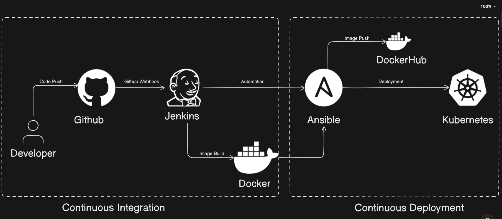

# 📝 TODO List – DevOps Project (Django + Docker + CI/CD + AWS + Ansible + Kubernetes)

This repository demonstrates a fully automated CI/CD pipeline for deploying applications using GitHub, Jenkins, Docker, Ansible, and Kubernetes

> 💡 The project is designed to help beginners understand real-world DevOps concepts with practical implementation.

# Overview

This project showcases a complete Continuous Integration (CI) and Continuous Deployment (CD) pipeline. It allows developers to push code to GitHub, automatically build Docker images, and deploy the application to a Kubernetes cluster using Ansible automation.

---

## 🚀 Tech Stack & Tools

- **Django** – Backend web framework for Python
- **Docker** – Containerization
- **Git** – Source control
- **GitHub** – Code repository and webhook integration
- **Docker Hub** – Hosting Docker images
- **CI/CD Tool** – Jenkins
- **Webhooks** – To auto-trigger the pipeline
- **AWS EC2** – Hosting the live containerized application
- **Ansible** – Automation tool for deployment
- **Kubernetes** – Container orchestration platform

---
## ⚙️ Workflow

Developer pushes code to GitHub.

GitHub webhook triggers Jenkins pipeline.

Jenkins builds the Docker image and pushes it to DockerHub.

Ansible pulls the latest image from DockerHub.

Ansible deploys the image to Kubernetes.

The application is now live and running in the Kubernetes cluster.

## ⚙️ 🏗️ Architecture

📸 Screenshots 

The diagram below illustrates the flow.

👨‍💻 Author

Salil Gupta – DevOps Enthusiast

🔗 GitHub:https://github.com/salilgupta332/

